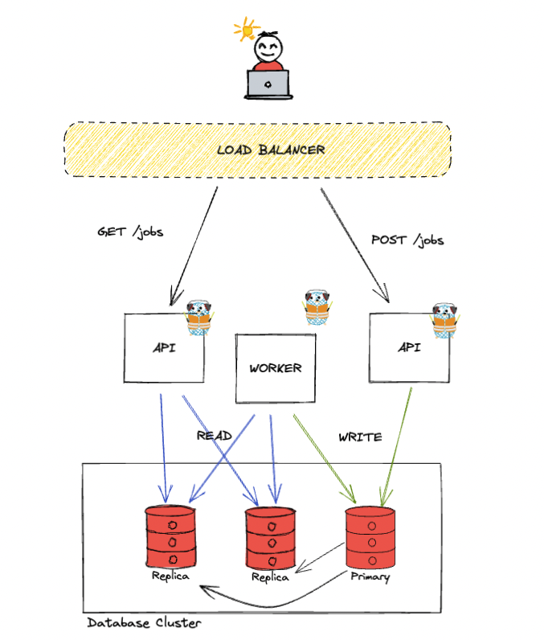
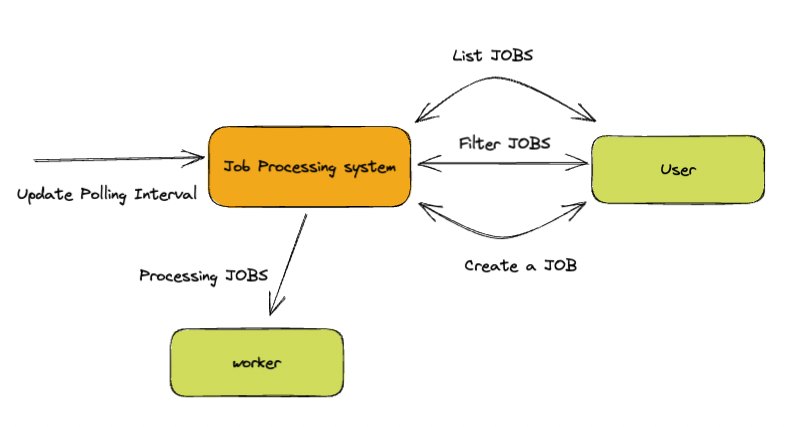
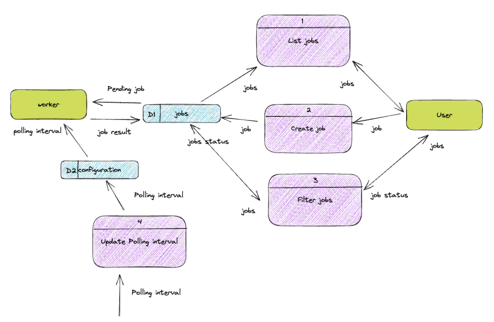

# Job Processing System

### System Architecture

### Data Flow Diagrams

### How to run

The project can be set up by Makefile commands:

- make start/api
- make start/worker

Both commands must be run in different sessions.
The API can be found at localhost:3000, with the /jobs endpoint, only GET and POST methods are allowed.
