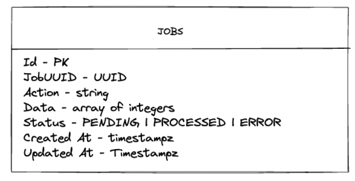

# Job Processing System


### System Architecture


### Data Flow Diagrams





### How to run

> This project is a simple replica to see the system running.

The project can be set up by Makefile commands:

- make start/api
- make start/worker

Both commands must be run in different sessions.
The API can be found at localhost:3000, with the /jobs endpoint, only GET and POST methods are allowed.

#### Enqueue a JOB:


This it's an example of enqueue a JOB on POST /jobs:

```json
{
  "action": "sum",
  "data": [1, 2, 3]
}
```

And their response

```json
{
  "message": "job enqueued"
}
```

It's allowed just "sum" and "sub" actions.


### Filters

It's allowed to filter jobs through `status` query parameter on GET /jobs

- done
- processed
- error